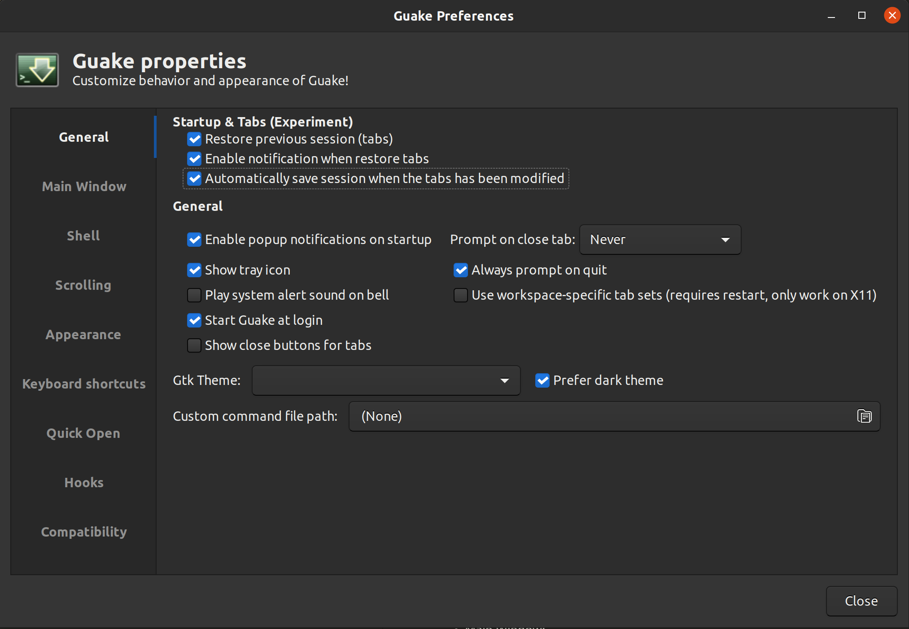
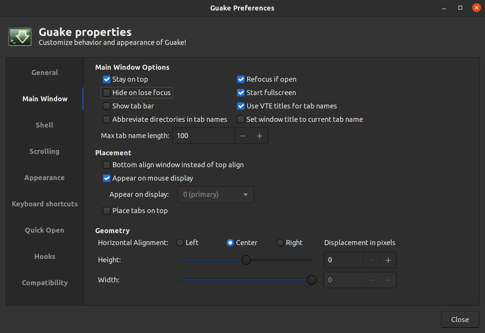
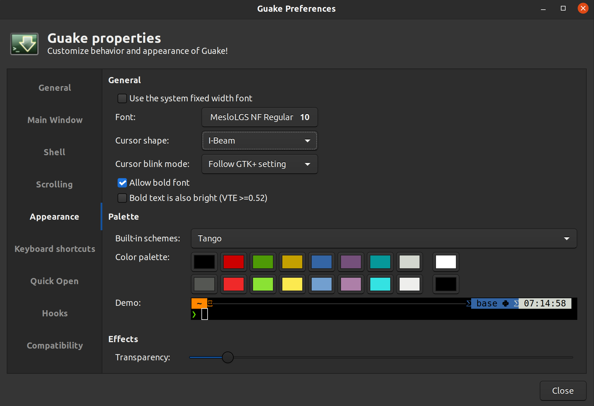

# Dotfiles

## [Guide](https://github.com/anishathalye/dotbot)

Just clone and run install script

# Manual Stuff

## Link to local .rc

manual/link.sh

## Install Fonts

manual/fonts.sh

### Terminal fonts
Change terminal font in terminal preferences

### Vscode with zsh fonts
Change font to "MesloLGS NF" in vscode integrated terminal settings

If this doesn't work lookup font name in OS fonts and set it as that

# Local Files

## Aliases

$HOME/.aliases-local.zsh

## Environment Variables

$HOME/.zshrc

Tracked ZSH config is in $HOME/.zshrc-template

# Other stuff

## Guake

```bash
sudo apt-get install guake
```

**Current apt version is out of date for double-click tmux fix**

Compile from source: https://guake.readthedocs.io/en/latest/user/installing.html#system-wide-installation

Prefs:








Add shortcut to Ubuntu matching toggle gauke shortcut (Super + Space):

May require you to bind previous Super + Space key. Usually is switching input source key.

Command: `guake-toggle`